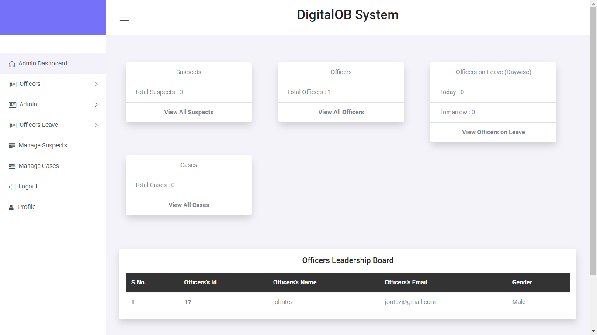
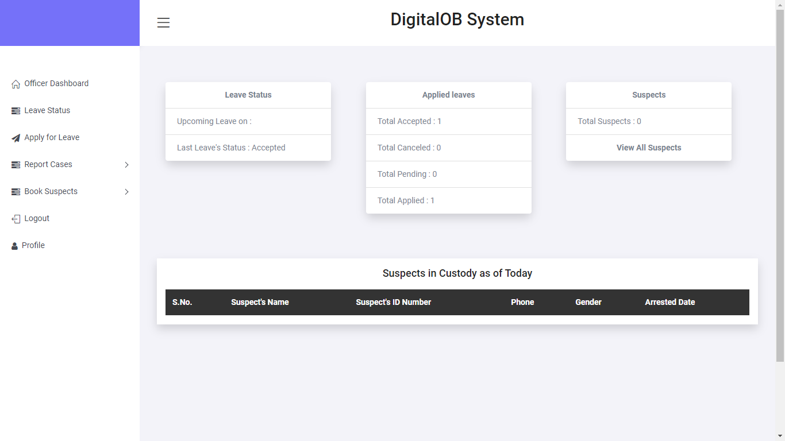

# DigitalOB
The Digital police OB is a web based application that
# Product Features
### Data Capturing 
The data in the station will be recorded in the system, saved and stored in the 
database.
### Monitoring and Tracking
The system will enable different people including the police bosses in the station, 
the general citizens and the officers to be able to monitor and track the progress of 
reported cases in the station.
### Data Integrity
The system will promote data integrity, such that once a case has been reported, 
recorded and filed it will not be able to be altered or manipulated by anyone with 
malicious intentions.
### Data retrieval 
Any needed information from the system will be retrieved easily as all the cases 
informed will be stored and backed up in the database
will run on a web browser. 
## Technologies used
* JavaScript
* CSS 
* MySql
* Php

# Screenshots
# Landing Page screens
 

# Admin DashBoard Screen

# Officers Dashboard Screen

## Pre-requisites
- Basic javascript,php,mysql ,Xampp, Visual Studio Code and Git knowledge, including an installed version of Git.

## Setup & Installation
* Clone the project into your machine from `https://github.com/johnkaizer/DigitalOB.git` or download the code, extract the files.
* Run the project in the forked root folder- gradle run.
* Install Xampp Server and start Mysql and Apache.
* copy the ectracted file in the xampp 'htdocs' folder.
* Open browser and search 'http://localhost/phpmyadmin/'.
* Create data base 'digitalOb' and import the 'digitalob.db' file from the project an the admin password are written in the file.
* open your bowsers and search 'http://localhost://your folder name/index.php'.

## Development
Want to contribute? Great!
To fix a bug or enhance an existing module, follow these steps:

- Fork the repo
- Create a new branch (`git checkout -b improve-feature`)
- Make the appropriate changes in the files
- Add changes to reflect the changes made
- Commit your changes (`git commit -am 'Improve feature'`)
- Push to the branch (`git push origin improve-feature`)
- Create a Pull Request
