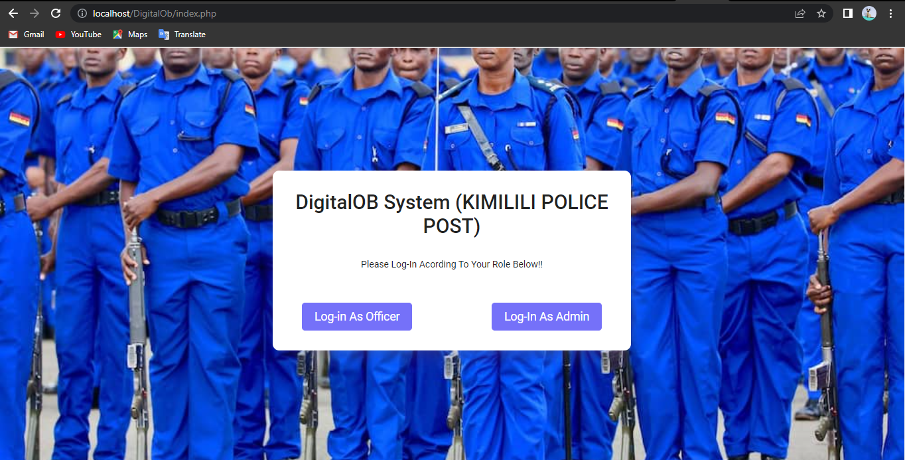
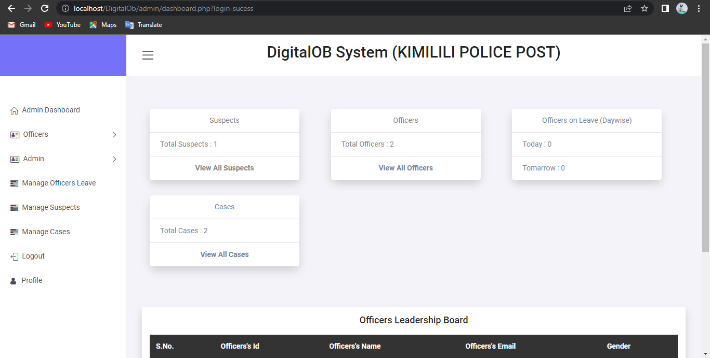
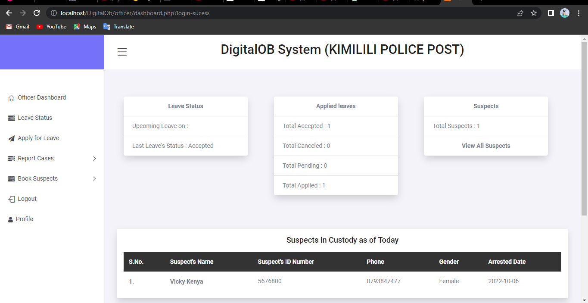

# DigitalOB
A Foundation envisions on global community that empowers, upholds the dignity and protects the rights of every girl child and extends that to her caregivers and community.
Our story began on August 26th 2013, with an emotive feature titled “Period of Shame” on Citizen TV, which caught the attention of many people, our founder, Janet Mbugua, included. 
## Technologies used
* JavaScript-
* CSS- 
* MySql-
* Php- 

# Screenshots
# Landing Page screens
 

# Admin DashBoard Screen

# Officers Dashboard Screen

## Pre-requisites
- Basic javascript,php,mysql ,Xampp, Visual Studio Code and Git knowledge, including an installed version of Git.

## Setup & Installation
* Clone the project into your machine from `https://github.com/johnkaizer/DigitalOB.git` or download the code, extract the files.
* Run the project in the forked root folder- gradle run.
* Install Xampp Server and start Mysql and Apache.
* copy the ectracted file in the xampp 'htdocs' folder.
* Open browser and search 'http://localhost/phpmyadmin/'.
* Create data base 'digitalOb' and import the 'digitalob.db' file from the project an the admin password are written in the file.
* open your bowsers and search 'localhost://your folder name/index.php'.

## Development
Want to contribute? Great!
To fix a bug or enhance an existing module, follow these steps:

- Fork the repo
- Create a new branch (`git checkout -b improve-feature`)
- Make the appropriate changes in the files
- Add changes to reflect the changes made
- Commit your changes (`git commit -am 'Improve feature'`)
- Push to the branch (`git push origin improve-feature`)
- Create a Pull Request
